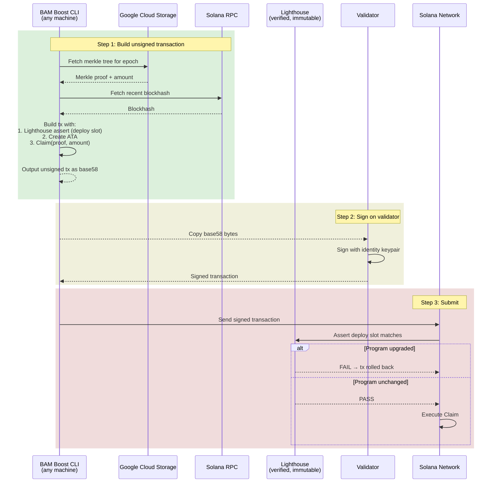
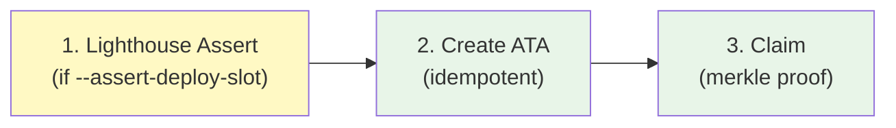

# Jito BAM Boost CLI

CLI for safely claiming JIP-31 BAM Boost subsidies. Supports validator signing and program integrity guards.

## Security Model

The CLI can sign and submit directly when the keypair is local (signed mode), or — shown below — **separate transaction construction from signing** so the validator identity keypair never needs to be on the same machine as the CLI (offline mode). See [Usage](#usage) for both.



## Features

| Feature | Description |
|---------|-------------|
| **Validator signing (`--address`)** | Build unsigned transactions without a keypair on the machine. Send to the validator box for signing with the identity keypair. |
| **Program integrity guard (`--assert-deploy-slot`)** | **On by default.** Prepends a [Lighthouse](https://github.com/Jac0xb/lighthouse) assertion that the BAM Boost ProgramData hasn't been upgraded. Transaction rolls back atomically if bytecode changed. Defaults to `auto` (resolves the program's current deploy slot from RPC at build time); pass an explicit slot to pin a known value, or `off` to disable. |
| **Scan-all claim (omit `--epoch`)** | Omit `--epoch` to scan every epoch from `--first-epoch` through the current epoch and claim each eligible one. Epochs with no published tree, no allocation, or an existing claim are skipped; per-epoch errors don't abort the scan. |
| **Automatic RPC fallback** | Every RPC call tries `--rpc-url` first, then falls back to the public `solana-rpc.publicnode.com` if it errors/times out — so a flaky primary endpoint doesn't abort a run. |
| **Transaction inspection (`--print-tx`)** | Output the unsigned transaction as base58 for review before signing. |
| **Safe defaults** | `--address` mode forces unsigned output. `--print-tx` prevents accidental sending. |

## Usage

There are **two ways to claim**, both fully supported. Pick based on where the identity keypair lives:

| Mode | Flag | What the CLI does | Use when |
|------|------|-------------------|----------|
| **Signed (default)** | `--signer <keypair>` | Builds, signs, **and submits** the transaction in one command | The identity keypair is on the machine running the CLI |
| **Offline / unsigned (optional)** | `--address <pubkey>` | Builds the **unsigned** transaction only; you sign and submit it elsewhere | You want the keypair to stay off the build machine |

The two are mutually exclusive (`--signer` conflicts with `--address`). Everything else — the integrity guard, scan-all, JSON output — works identically in both modes.

### Signed claim — build, sign, and submit (default)

With the identity keypair on this machine, the CLI does the whole thing — no manual signing or submission step:

```bash
cargo r -p jito-bam-boost-cli -- \
    --signer <PATH_TO_IDENTITY_KEYPAIR> \
    --rpc-url <RPC_URL> \
    --commitment confirmed \
    --assert-deploy-slot 396979600 \
    bam-boost merkle-distributor claim \
    --network mainnet \
    --epoch <EPOCH>
```

This builds the transaction, signs it with `--signer`, sends it, and waits for confirmation. It works for a single `--epoch` or for [scan-all mode](#claim-all-epochs-scan-mode) (omit `--epoch`).

> The program-integrity guard is **on by default** (`--assert-deploy-slot auto`), so you can omit the flag and the CLI resolves the program's current deploy slot from RPC. Passing an explicit slot (as above) pins a known-good value — preferable for high-assurance flows — and `--assert-deploy-slot off` disables the guard entirely.

### Offline / unsigned claim — sign on another box (optional)

Use this when the identity keypair must stay off the machine running the CLI. The CLI (with `--address`, no keypair) only **builds** the unsigned transaction; you transport it to the box that holds the key, sign it there, and submit.

**Step 1** — Build unsigned transaction (no keypair needed):

```bash
cargo r -p jito-bam-boost-cli -- \
    --address <VALIDATOR_IDENTITY_PUBKEY> \
    --rpc-url <RPC_URL> \
    --commitment confirmed \
    --assert-deploy-slot 396979600 \
    bam-boost merkle-distributor claim \
    --network mainnet \
    --epoch <EPOCH> \
    > unsigned_tx.b58
```

**Step 2** — Sign the transaction on the box that holds the identity keypair.

The signature is an ed25519 signature over the transaction message bytes, spliced into the wire format the CLI emits (`[numSignatures][64-byte sigs...][message]`). Note that the stock `solana` CLI **cannot** sign an externally-built transaction like this (`sign-offchain-message` signs off-chain messages only, in a different domain), so use a hardware wallet, HSM, or a minimal ed25519 signer on that box.

> The unsigned transaction uses a **recent blockhash**, which is valid for only ~60–90 seconds. Sign and submit promptly; if it expires, rebuild and re-sign.

**Step 3** — Submit the signed transaction via RPC `sendTransaction`:

```bash
curl -s <RPC_URL> -X POST -H 'Content-Type: application/json' -d '{
  "jsonrpc":"2.0","id":1,"method":"sendTransaction",
  "params":["<SIGNED_TX_BASE64>", {"encoding":"base64"}]
}'
```

### Inspect with `--print-tx` (with keypair, without sending)

```bash
cargo r -p jito-bam-boost-cli -- \
    --signer <PATH_TO_IDENTITY_KEYPAIR> \
    --rpc-url <RPC_URL> \
    --commitment confirmed \
    --print-tx \
    bam-boost merkle-distributor claim \
    --network mainnet \
    --epoch <EPOCH>
```

### Claim all epochs (scan mode)

Omit `--epoch` to scan through the current epoch and claim every eligible epoch in one run. Omit `--first-epoch` too and the CLI walks back from the current epoch to auto-discover the earliest epoch with a published merkle tree (no hardcoded launch epoch); pass `--first-epoch <N>` to bound the scan explicitly. Already-claimed epochs, epochs with no published merkle tree, and epochs where the claimant has no allocation are skipped automatically; a failure on one epoch is logged and the scan continues.

```bash
cargo r -p jito-bam-boost-cli -- \
    --signer <PATH_TO_IDENTITY_KEYPAIR> \
    --rpc-url <RPC_URL> \
    --commitment confirmed \
    bam-boost merkle-distributor claim \
    --network mainnet            # no --first-epoch: auto-discovers the earliest claimable epoch
```

This also works in validator-signing mode (`--address`), emitting one unsigned base58 transaction per eligible epoch.

#### Idempotent — safe to re-run

The scan only produces transactions for epochs you haven't claimed yet. For each epoch it reads the on-chain **claim-status PDA**; if that account exists, the epoch is reported as already claimed and **no transaction is emitted** for it. So once a claim lands, the next scan automatically excludes that epoch — you can run this on a timer and it will only ever build the claims that are still outstanding.

For example, after landing the epoch 980 claim in [`4U9Ha6…AjuFmJK`](https://solscan.io/tx/4U9Ha6dqKx7gJcRqFAWLyWin8nWt1FEVEBrbe6ufdLzFdvxyFs7Z3YV6jyWzrJE7K2GincekGH5K1kjWqAjuFmJK), re-scanning that validator logs `Epoch 980: already claimed` and drops 980 from the manifest, leaving only the remaining unclaimed epochs.

> **Use your validator _identity_ pubkey.** BAM Boost merkle trees are keyed by the validator identity key, not the vote account. If `--signer`/`--address` resolves to a vote account (or any other key), every epoch reports "no rewards." Get the right key with `solana-keygen pubkey <identity-keypair>`.

### JSON manifest output (automation / Ansible)

Pass `--output json` to emit a single JSON array on **stdout** — one object per built unsigned transaction. All logs and diagnostics go to **stderr**, so stdout is always clean, parseable JSON. This is the recommended integration point for Ansible, CI, or any signer-orchestration pipeline: capture stdout, parse it, and route each `unsigned_tx_base58` / `unsigned_tx_base64` to the validator box for signing.

```bash
cargo r -q -p jito-bam-boost-cli -- \
    --address <VALIDATOR_IDENTITY_PUBKEY> \
    --commitment confirmed \
    --output json \
    bam-boost merkle-distributor claim --first-epoch 912 \
    > unsigned_manifest.json
```

Each entry contains **only** the serialized transaction — no epoch, amount, claimant, blockhash, or guard fields:

```json
[
  {
    "unsigned_tx_base58": "a7rZWTC...",
    "unsigned_tx_base64": "AQAAAA..."
  }
]
```

This is deliberate. A signer must verify **what it is signing by decoding the transaction bytes**, not by trusting sidecar metadata that could disagree with the actual transaction. To inspect an entry before signing (epoch, amount, accounts, the Lighthouse guard slot), decode it:

```bash
solana decode-transaction <unsigned_tx_base64> base64
```

`unsigned_tx_base64` is in the exact encoding Solana RPC expects for `simulateTransaction` / `sendTransaction` with `encoding: "base64"`. Each transaction uses a recent blockhash (valid ~60–90s), so sign and submit the manifest promptly; rebuild if it goes stale.

Example Ansible task:

```yaml
- name: Build unsigned BAM Boost claim manifest
  ansible.builtin.command:
    cmd: >-
      jito-bam-boost-cli
      --address {{ validator_identity }}
      --commitment confirmed
      --output json
      bam-boost merkle-distributor claim --first-epoch 912
  register: claim_manifest
  changed_when: false

- name: Parse manifest
  ansible.builtin.set_fact:
    unsigned_claims: "{{ claim_manifest.stdout | from_json }}"

- name: Hand each unsigned tx to the signer (decode on the key box to verify before signing)
  ansible.builtin.include_tasks: sign_and_submit.yml
  loop: "{{ unsigned_claims }}"
  loop_control:
    index_var: idx
    label: "claim #{{ idx }}"
```

> `--output text` (the default) prints one base58 transaction per line instead — convenient for shell pipelines.

### Check claim status

```bash
cargo r -p jito-bam-boost-cli -- \
    --commitment confirmed \
    bam-boost claim-status get \
    --epoch <EPOCH> \
    --claimant <VALIDATOR_IDENTITY_PUBKEY>
```

## Transaction Instruction Order



| Position | Instruction | When included | Purpose |
|----------|-------------|---------------|---------|
| 1 | `AssertUpgradeableLoaderAccount` | `--assert-deploy-slot` enabled | Lighthouse guard — tx fails if program bytecode changed |
| 2 | `CreateIdempotent` | Always | Creates JitoSOL ATA if needed |
| 3 | `Claim` | Always | Claims JitoSOL via merkle proof |

## Flags Reference

| Flag | Required | Description |
|------|----------|-------------|
| `--signer <path>` | One of signer/address | Path to identity keypair (signs + sends) |
| `--address <pubkey>` | One of signer/address | Claimant pubkey (outputs unsigned tx) |
| `--rpc-url <url>` | No (default: mainnet) | Primary Solana RPC endpoint. On failure, each RPC call automatically falls back to the public `solana-rpc.publicnode.com` |
| `--commitment <level>` | Yes | `confirmed` or `finalized` |
| `--print-tx` | No | Output unsigned tx instead of sending |
| `--output <text\|json>` | No (default: `text`) | Format for built unsigned txs. `text` = base58 per line; `json` = manifest array on stdout (logs on stderr) for automation |
| `--assert-deploy-slot <auto\|slot\|off>` | No (default: `auto`) | Lighthouse program-integrity guard. `auto` resolves the current ProgramData deploy slot from RPC; a number pins an explicit slot; `off` disables it |
| `--network <mainnet\|testnet>` | No (default: mainnet) | Network for merkle tree GCS path |
| `--epoch <epoch>` | No | Epoch to claim. Omit to scan/claim all eligible epochs |
| `--first-epoch <epoch>` | No (default: auto-discover) | First epoch to scan in scan-all mode (when `--epoch` omitted). Omit to walk back from the current epoch to the earliest published merkle tree |

> `--epoch` and `--first-epoch` are arguments of the `claim` subcommand (after `bam-boost merkle-distributor claim`), not global flags.

## Lighthouse Program

The `--assert-deploy-slot` flag uses the [Lighthouse](https://github.com/Jac0xb/lighthouse) assertion program:

| Property | Value |
|----------|-------|
| Program ID | `L2TExMFKdjpN9kozasaurPirfHy9P8sbXoAN1qA3S95` |
| Source | [github.com/Jac0xb/lighthouse](https://github.com/Jac0xb/lighthouse) |
| Verified build | [verify.osec.io/status/L2TExMFKdjpN9kozasaurPirfHy9P8sbXoAN1qA3S95](https://verify.osec.io/status/L2TExMFKdjpN9kozasaurPirfHy9P8sbXoAN1qA3S95) |
| On-chain hash | `b70084e0d1de4a551c2bf9740a9b5012600edb98b56fd84065f0e8f47762529a` |
| Immutable | Yes (upgrade authority renounced, `is_frozen: true`) |
| Target account | `jpyyQB22b4NaE4SddyzoNcSeUsUbGtBMgX9pBWdPPSr` (BAM Boost ProgramData) |
| Current deploy slot | `396979600` |

To get the current deploy slot:
```bash
solana-verify get-program-hash BoostxbPp2ENYHGcTLYt1obpcY13HE4NojdqNWdzqSSb
```
