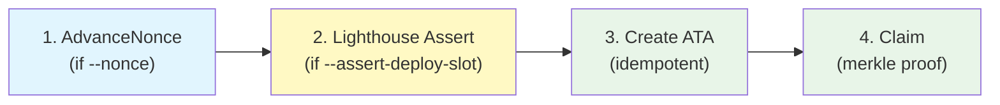

# Jito BAM Boost CLI

CLI for safely claiming JIP-31 BAM Boost subsidies. Supports validator signing, program integrity guards, and durable nonce support.

## Security Model

Separates **transaction construction** from **signing** so the validator identity keypair never needs to be on the same machine as the CLI.


## Features

| Feature | Description |
|---------|-------------|
| **Validator signing (`--address`)** | Build unsigned transactions without a keypair on the machine. Send to the validator box for signing with the identity keypair. |
| **Program integrity guard (`--assert-deploy-slot`)** | Prepends a [Lighthouse](https://github.com/Jac0xb/lighthouse) assertion that the BAM Boost ProgramData hasn't been upgraded. Transaction rolls back atomically if bytecode changed. |
| **Durable nonces (`--nonce`)** | Use durable transaction nonces for long-lived transactions with no 90-second blockhash expiry. |
| **Transaction inspection (`--print-tx`)** | Output the unsigned transaction as base58 for review before signing. |
| **Safe defaults** | `--address` mode forces unsigned output. `--print-tx` prevents accidental sending. |

## Usage

### Direct claim (with keypair on this machine)

```bash
cargo r -p jito-bam-boost-cli -- \
    --signer <PATH_TO_IDENTITY_KEYPAIR> \
    --rpc-url <RPC_URL> \
    --commitment confirmed \
    --assert-deploy-slot 396979600 \
    bam-boost merkle-distributor claim \
    --network mainnet \
    --epoch <EPOCH>
```

### Validator signing (recommended)

**Step 1** — Build unsigned transaction (no keypair needed):

```bash
cargo r -p jito-bam-boost-cli -- \
    --address <VALIDATOR_IDENTITY_PUBKEY> \
    --rpc-url <RPC_URL> \
    --commitment confirmed \
    --assert-deploy-slot 396979600 \
    bam-boost merkle-distributor claim \
    --network mainnet \
    --epoch <EPOCH> \
    > unsigned_tx.b58
```

**Step 2** — Sign the transaction on the validator (where the identity keypair lives):

```bash
# Decode base58, sign with identity keypair, re-encode
# (use solana CLI, a hardware wallet, or custom signing tool)
```

**Step 3** — Submit the signed transaction:

```bash
solana send-transaction <signed_tx_base58> --rpc-url <RPC_URL>
```

### With durable nonce (no blockhash expiry)

```bash
# Create a nonce account first (one-time setup):
solana create-nonce-account nonce-account.json 0.0015 \
    --nonce-authority nonce-authority.json

# Build transaction with durable nonce:
cargo r -p jito-bam-boost-cli -- \
    --address <VALIDATOR_IDENTITY_PUBKEY> \
    --rpc-url <RPC_URL> \
    --commitment confirmed \
    --assert-deploy-slot 396979600 \
    --nonce <NONCE_ACCOUNT_PUBKEY> \
    --nonce-authority <NONCE_AUTHORITY_PUBKEY> \
    bam-boost merkle-distributor claim \
    --network mainnet \
    --epoch <EPOCH> \
    > unsigned_tx.b58
```

### Inspect with `--print-tx` (with keypair, without sending)

```bash
cargo r -p jito-bam-boost-cli -- \
    --signer <PATH_TO_IDENTITY_KEYPAIR> \
    --rpc-url <RPC_URL> \
    --commitment confirmed \
    --print-tx \
    bam-boost merkle-distributor claim \
    --network mainnet \
    --epoch <EPOCH>
```

### Check claim status

```bash
cargo r -p jito-bam-boost-cli -- \
    --commitment confirmed \
    bam-boost claim-status get \
    --epoch <EPOCH> \
    --claimant <VALIDATOR_IDENTITY_PUBKEY>
```

## Transaction Instruction Order



| Position | Instruction | When included | Purpose |
|----------|-------------|---------------|---------|
| 1 | `AdvanceNonceAccount` | `--nonce` provided | Durable nonce — replaces blockhash |
| 2 | `AssertUpgradeableLoaderAccount` | `--assert-deploy-slot` provided | Lighthouse guard — tx fails if program bytecode changed |
| 3 | `CreateIdempotent` | Always | Creates JitoSOL ATA if needed |
| 4 | `Claim` | Always | Claims JitoSOL via merkle proof |

## Flags Reference

| Flag | Required | Description |
|------|----------|-------------|
| `--signer <path>` | One of signer/address | Path to identity keypair (signs + sends) |
| `--address <pubkey>` | One of signer/address | Claimant pubkey (outputs unsigned tx) |
| `--rpc-url <url>` | No (default: mainnet) | Solana RPC endpoint |
| `--commitment <level>` | Yes | `confirmed` or `finalized` |
| `--print-tx` | No | Output unsigned base58 tx instead of sending |
| `--assert-deploy-slot <slot>` | No | Lighthouse guard: expected ProgramData deploy slot |
| `--nonce <pubkey>` | No | Durable nonce account for long-lived transactions |
| `--nonce-authority <pubkey>` | No | Nonce authority (defaults to nonce account pubkey) |
| `--network <mainnet\|testnet>` | No (default: mainnet) | Network for merkle tree GCS path |

## Lighthouse Program

The `--assert-deploy-slot` flag uses the [Lighthouse](https://github.com/Jac0xb/lighthouse) assertion program:

| Property | Value |
|----------|-------|
| Program ID | `L2TExMFKdjpN9kozasaurPirfHy9P8sbXoAN1qA3S95` |
| Source | [github.com/Jac0xb/lighthouse](https://github.com/Jac0xb/lighthouse) |
| Verified build | [verify.osec.io/status/L2TExMFKdjpN9kozasaurPirfHy9P8sbXoAN1qA3S95](https://verify.osec.io/status/L2TExMFKdjpN9kozasaurPirfHy9P8sbXoAN1qA3S95) |
| On-chain hash | `b70084e0d1de4a551c2bf9740a9b5012600edb98b56fd84065f0e8f47762529a` |
| Immutable | Yes (upgrade authority renounced, `is_frozen: true`) |
| Target account | `jpyyQB22b4NaE4SddyzoNcSeUsUbGtBMgX9pBWdPPSr` (BAM Boost ProgramData) |
| Current deploy slot | `396979600` |

To get the current deploy slot:
```bash
solana-verify get-program-hash BoostxbPp2ENYHGcTLYt1obpcY13HE4NojdqNWdzqSSb
```
